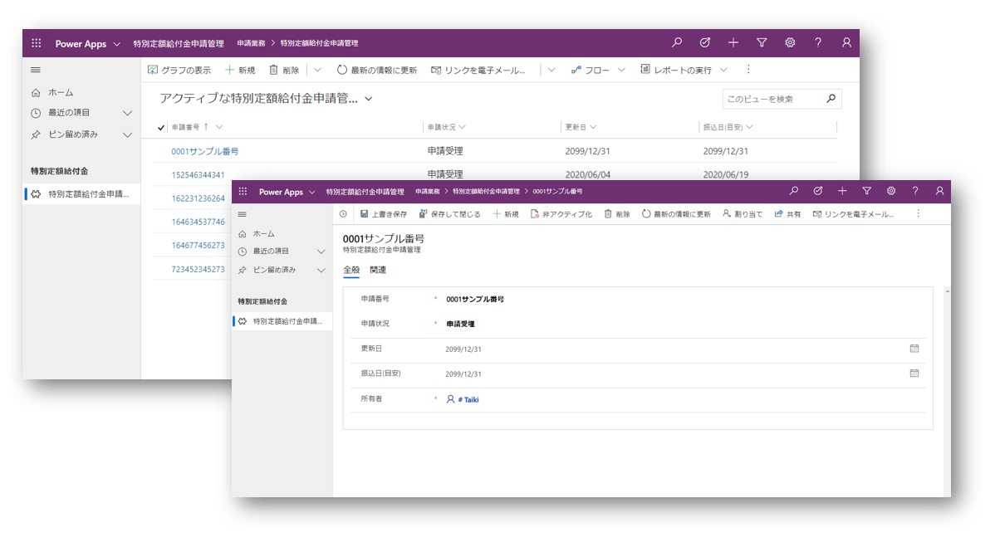
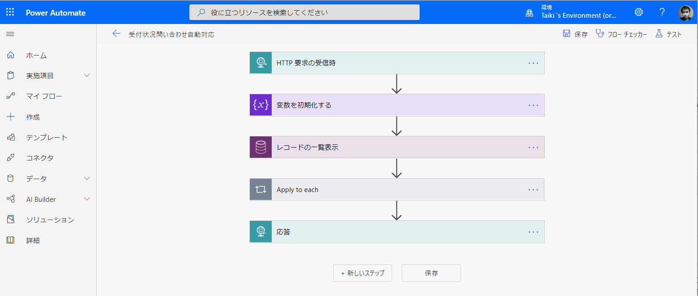

# 自治体向けソリューションテンプレート
## はじめに
このテンプレートはMicrosoft Power Platform の各種サービスを用いた、自治体向けのテンプレートです。利用するには最小限のセットアップで利用可能です。
テンプレートでは以下のサービスを活用し、自治体における新型コロナウイルス対策としてのアプリやサービスを構築できます。
- [Microsoft Power Apps](https://powerapps.microsoft.com/)
- [Microsoft Power Automate](https://flow.microsoft.com/)
- [Microsoft Power Virtual Agents](https://powervirtualagents.microsoft.com/)
- [Microsoft Power BI](https://powerbi.microsoft.com/)
- [Twilio](https://www.twilio.com/ja/)

## テンプレートへの貢献企業・団体
[株式会社ソントレーゾ](https://sentreseau.com/)
[株式会社セカンドファクトリー](http://www.2ndfactory.com/)
[非営利団体コロナ対策エンジニア](https://www.covid19engr.com/)

## テンプレートに含まれるもの
### 特定定額給付金進捗管理アプリ
自治体の方々が特定定額給付金の手続き進捗管理を行うためのPower Appsを用いたアプリケーションです。

### 特定定額給付金進捗管理フロー
Power Automateを用いて設定する、TwilioとPower Appsを連携するためのフローです。

### 特定定額給付金進捗管理問い合わせ自動応答設定
Twilioでの電話応対自動対応のための設定です。

### 感染者状況ダッシュボード
感染者の状況を確認するためのダッシュボードです。

## 構築/設定手順
現在準備中です。準備が整い次第、公開いたします。

## ダウンロード
- [特定定額給付金進捗管理アプリ](https://github.com/covid19-engr/gov-powerplatform-template/raw/master/solution/特定定額給付金進捗管理アプリ_1_0_0_0.zip)
- [特定定額給付金進捗管理フロー](https://github.com/covid19-engr/gov-powerplatform-template/raw/master/solution/特定定額給付金進捗管理フロー_1_0_0_0.zip)
- 特定定額給付金進捗管理問い合わせ自動応答設定（準備中）
- 感染者状況ダッシュボード（準備中）

## 更新情報
日付（日本時間） | 備考
-|-
0.1|情報公開

## サポートへのお問い合わせ
本ソリューションを利用するにあたって、マイクロソフトコーポレーション並びに日本マイクロソフト株式会社、Twilio社へサポートチケットは発行いただけません。

### 免責事項
*本ソリューションはサンプルとして提供されており、マイクロソフトコーポレーション並びに日本マイクロソフト株式会社（以下、マイクロソフト）、Twilio社に許可・許諾は得ておりません。
本ソリューションを通じた専門的見解や診断、治療、判断を得るための代替手段としては利用しないでください。
本ソリューションをご利用される場合、利用にあたる責任やリスクは利用者にあるものとし、本コミュニティ及びマイクロソフト、Twilioは一切の責任を取らないものとします。*
